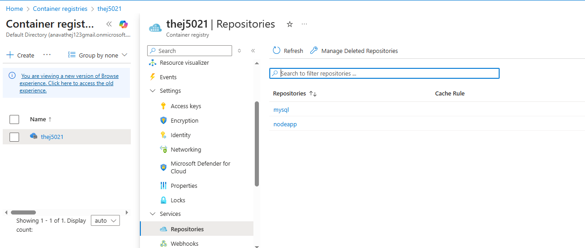
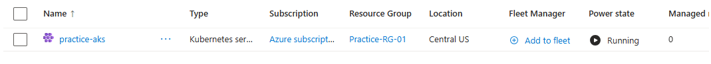
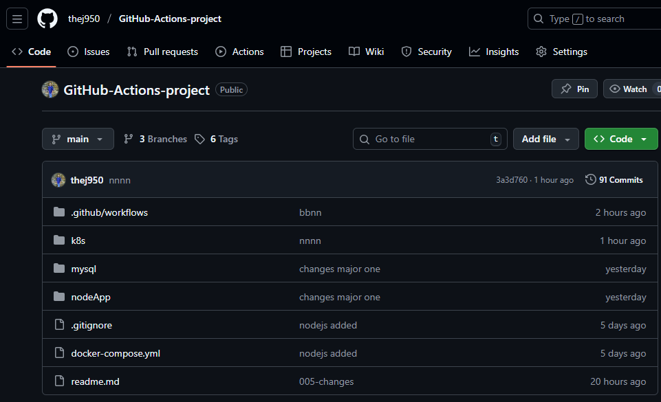
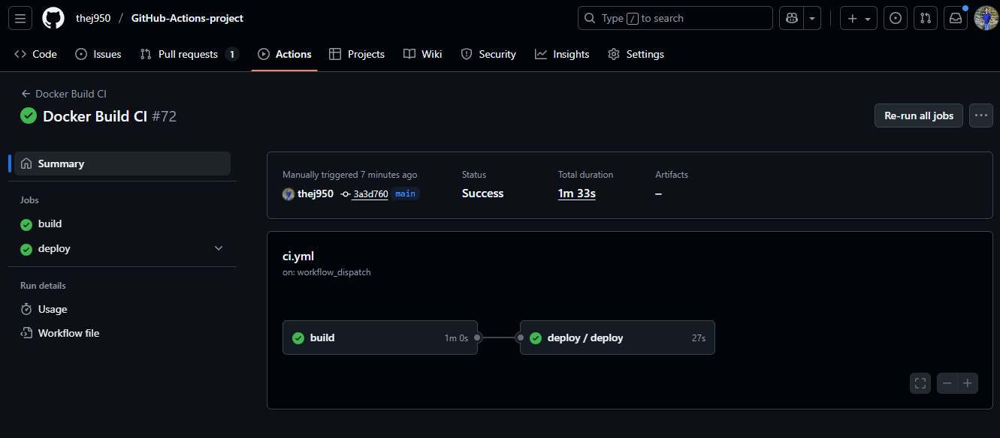
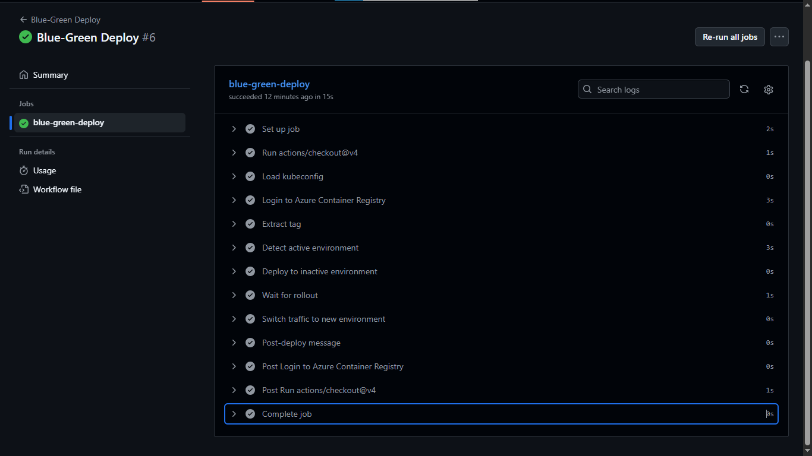
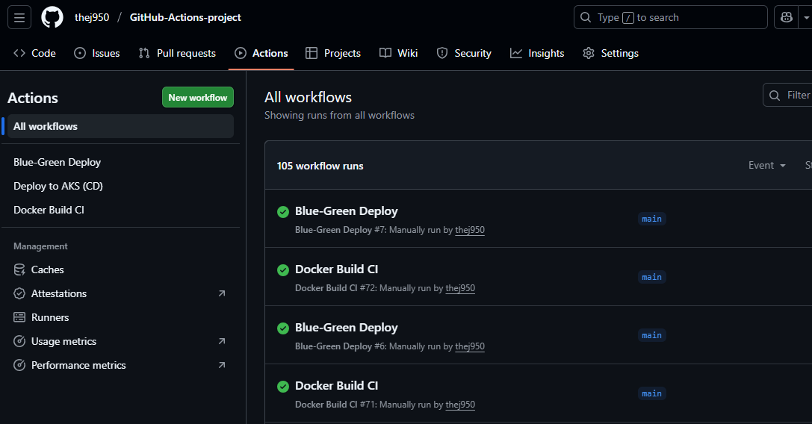
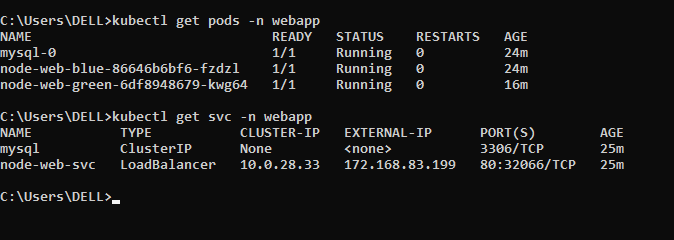
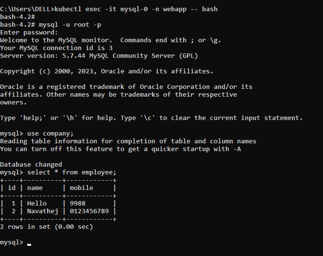

# 🚀 **GitHub Actions CI/CD Project — Deploy Node.js + MySQL to Azure AKS**

## 📌 **Project Overview**

> his project shows how I built a full CI/CD pipeline using GitHub Actions to deploy a Node.js frontend and a MySQL backend into an Azure Kubernetes Service (AKS) cluster.
> 
> The pipeline automatically builds Docker images, scans them for any security issues, pushes the images into Azure Container Registry (ACR), and then deploys the updated Kubernetes files into AKS.
> 
> ---

# 🔧 **CI Pipeline (ci.yml)**

### ✔ Trigger

* Runs on **push to main**
* Runs on **tag push (v*)**

### ✔ Key Steps

1. **Checkout repository**
2. **Extract version tag**
3. **Login to ACR**
4. **Build Docker images** for Node.js + MySQL
5. **Scan images with Trivy**
6. **Push images to ACR**
7. **Trigger CD workflow**

---

# 🚀 **CD Pipeline (cd.yml)**

Triggered **only after CI success** using `workflow_call`.

### ✔ CD Steps

1. **Checkout code**
2. Load **AKS kubeconfig** from GitHub Secrets
3. **Verify Kubernetes connection** (`kubectl get nodes`)
4. Deploy all manifests in one shot:

   ```bash
   kubectl apply -f k8s/
   ```
5. Wait for Pods to be ready
6. Display running Pods & Services
   
---


---

# 🚀 **Blue-Green Deployment Pipeline (blue-green.yml)**

Triggered **manually** using `workflow_dispatch`.

---

## ✔ **Key Steps of Blue-Green Deployment**

1. Checkout repository
2. Load AKS kubeconfig
3. Login to ACR
4. Detect the current active environment
* Read the Service selector:

  ```yaml
  version: blue   # or green
  ```
* Based on this:

  * If **blue is active → deploy to green**
  * If **green is active → deploy to blue**

This ensures **no downtime** during upgrade.

5. Deploy new image to the inactive environment

* If **next environment = green**, pipeline runs:

  ```bash
  kubectl set image deployment/node-web-green \
      node-web=<ACR>/nodeapp:<tag>
  ```

6. Wait for rollout to complete

This updates containers **without affecting the live environment**.

Pipeline waits until the new Pods are ready:

```bash
kubectl rollout status deployment/node-web-green --timeout=5m
```

Guarantees the new version is healthy before switching traffic.

7. Switch traffic to the new environment

* Service selector is updated:

```bash
kubectl patch svc node-web-svc \
  -p '{"spec":{"selector":{"version":"green"}}}'
```

All user traffic now goes to the **new version**.

With this Blue-Green workflow:

* **No downtime updates**
* **Rollback is instant (change selector back to previous version)**
* **Only stable version gets production traffic**


# 🐳 **Dockerization**

### **Node.js Image**

* Uses Alpine base
* Installs dependencies
* Runs Express server on port 3000

### **MySQL Image**

* Initializes DB automatically using SQL scripts
* Custom configs possible for production

---

# ☸ **Kubernetes Deployment**

### **MySQL**

* Uses **StatefulSet** for stable storage
* PVC + PV ensure persistent data
* ClusterIP service for internal connectivity

### **Node.js**

* Deployment with replicas
* LoadBalancer service for browser access
* Connects to MySQL via internal DNS:

```
mysql.webapp.svc.cluster.local
```

---


# 🎯 **Key Features Delivered**

✔ Fully automated **CI/CD pipeline**
✔ Secure containerization with **Trivy scanning**
✔ Deployment to **Azure Kubernetes Service**
✔ Infrastructure as Code using **Kubernetes manifests**
✔ Node.js app stores form data into MySQL
✔ Persistent database using PV/PVC
✔ Version-based deployments using Git tags

---


# 🎯 This project demonstrates real-world Practice:

* Docker
* Kubernetes
* GitHub Actions
* ACR + AKS
* CI/CD automation
* Git tagging strategy
* YAML pipelines
* Stateful applications in Kubernetes

---


# Outputs

















